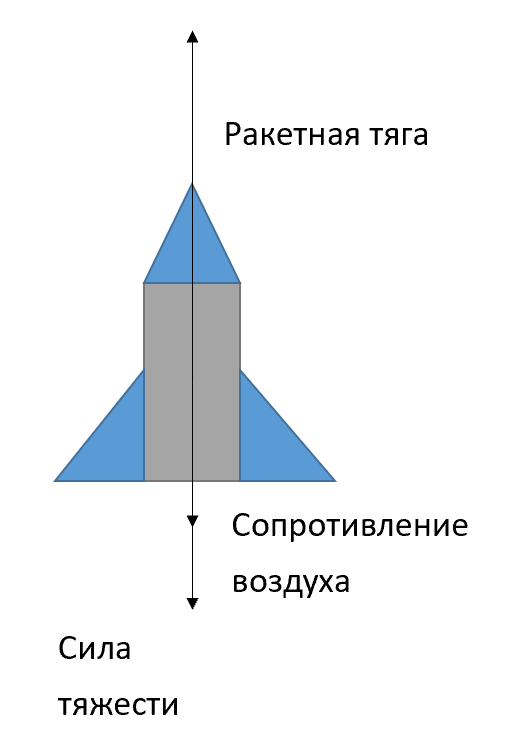
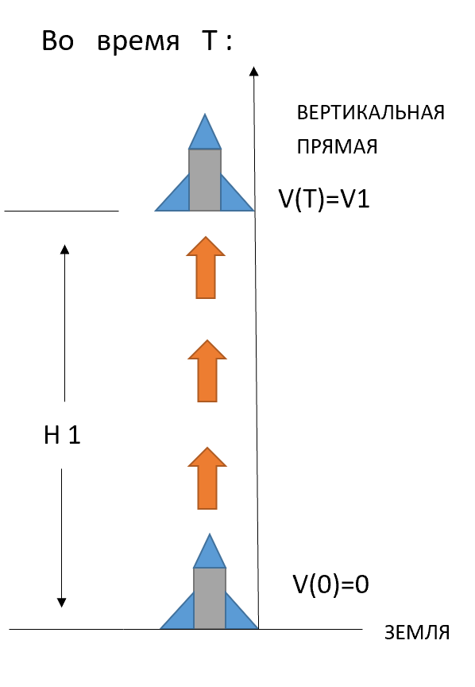

# «Задача оптимального управления взлетом ракеты»
## Постановка задачи
 В данной задаче ракета движется вдоль вертикальной прямой,т.е.Расстояние, которое она преодолела, совпадает с высотой, на которую она поднялась.Сначала ракета летит от земли вдоль вертикальной прямой. 
 
Пусть 
- $t$  —— время, 
- $h(t)$ —— высота ракеты над поверхностью земли, зависящая от t, 
- $v(t)$ —— скорость ракеты, зависящая от t, 
- $m(t)$ —— полная масса ракеты, зависящая от t, 
- $u(t)$ —— управление, зависящая от $t$.Здесь 
- $u(t)$ —— это скорость сгорания топлива,где $0\le u(t)\le u_{max}, 
- $u_{max}$ —— это фиксированное значение,если $u$ достигает $u_{max}$,значит что скорость, с которой ракета расходует топливо, достигает своего максимального значения, Комбинируя формулу кинематики и формулу для уменьшения массы сгорания топлива, можно получить следующее уравнения:
 

$\dot{h} \left (  t\right ) = v(t)$

$\dot{m} \left (  t\right ) = -r(t)$

Когда летит ракета, $h$ увеличивается, и масса уменьшается из-за сгорания топлива, скорость v может увеличиваться или уменьшаться. Далее анализируем силы и ускорение, действующие на ракету:

Любой объект обладает силой тяжести. При сгорании топлива ракета летит вверхза счет тяги двигателей, но сопротивление воздуха не позволяет ей двигаться вверх слишком быстро проанализировав силы, действующие на ракету, можно получить уравнение по вто- рому закону Ньютона.

$m(t)\dot{v}(t)=-m(t)g+u_{0}r(t)-\rho e^{-kh(t)}v^{2}(t)$

 Где:    
- $\dot{v}(t)$ —— **ускорение ракета**,

- $h(t)$ —— **высота ракеты над поверхностью земли,зависящая от $t$,**
       
- $v(t)$ —— **скорость ракеты, зависящая от $t$,**
         
- $m(t)$—— **полная масса ракеты, зависящая от $t$,**
         
- $r(t)$ ——  **скорость сгорания топлива,**
         
- $g$ —— **Ускорение силы тяжести,**
         
- $u_{0}$ —— **заданные константы**

Если уравнение обе часть делится на $m(t)$ то получится новое уравнение

$\dot{v}(t)=-g+\frac{u_{0}r(t) }{m(t)}- \frac{\rho e^{-kh(t)}v^{2}(t)  }{m(t)}$

Наконец,ракет достигает данной высоте $H1$ и скорости
$V1$,время $t$ не известно,обозначаться его $T$.

Для того,чтобы расход топлива сведен к минимуму в течение всего процесса взлета ракеты,надо брать оптимальное управление в каждом моменте,Затем, когда ракета достигает заданной высоты и скорости, остается как можно больше топлива.

T.е.в данной задаче,надо выбрать оптимальное управление u в каждом моменте,чтобы остаться как можно больше топлива в времени $T$. Т.е. $m(T)->max$
## Известные данные 
Сверившись с информацией,получится набор условий, аналогичных тем, которые должны быть выполнены при запуске реальной ракеты,$h(t)$ = 50000 $v(t)$ = 1500,$u_{max}$=500,$M_{0}$= 20000,k=0.00013,$\rho$=1.25,$u_{0}$=3000,g=9.8 и масса ракеты без топлива равна 2000

# Заключение
В данной работе решается задача оптимального управления при использовании принципа максимума понтрягина и численного меиода,и даётся При исследовании были получены следующие результаты:
- применен принцип максимума и записана краевая задача.
- Некоторые краевые задачи можно переписать в формуле задачи Коши,и решать по методом Эйлера.
- В процессе взлета ракеты,для оптимального управления,сначала u посталено $u_{max}$ и до некоторого времени u поставлено 0,и время зависит от точность разбиения $\phi$ и $\psi$ и dt,которые влияют на начальные условия.
- Когда точность разбиения $\psi$ и $\phi$ достигает определенного уровня, максимальная масса, а также высота и скорость, достигнутые за соответствующее время, не влияются.
- Для точности разбиения $dt$,чем точнее разбиение,тем решение точнее и лучше.
